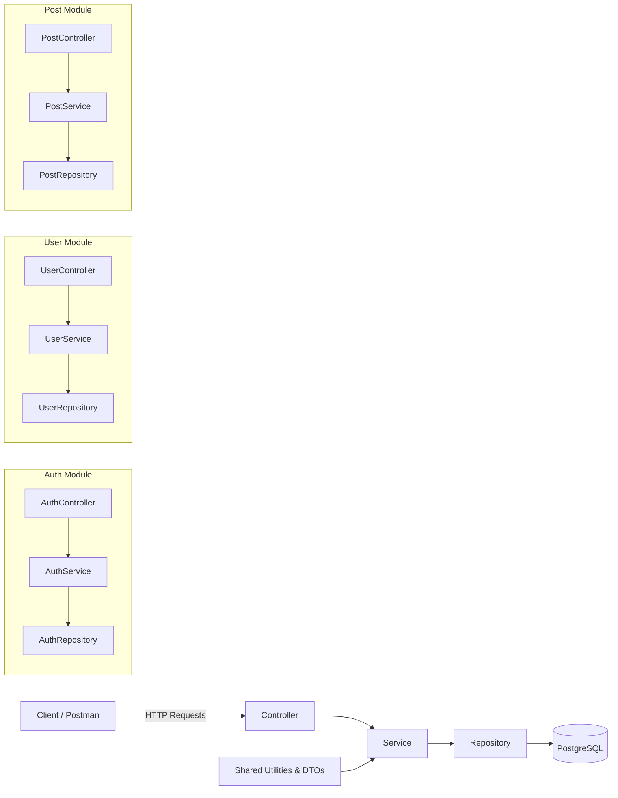

# 🌱 Spring Boot Blog API

A **production-grade RESTful API** built with **Spring Boot**, designed with a strong emphasis on **clean architecture, SOLID principles, and scalability**.

This project implements **secure JWT-based authentication with refresh tokens**, role-based access control (**USER/ADMIN**), **modular architecture**, and **full CRUD operations for blogs and user profiles**. The file upload system uses the **Strategy Pattern**, allowing seamless extension to cloud storage providers (S3, Cloudinary) without changing core logic.

With **DTO abstraction, global exception handling, request validation, pagination, and standardized API responses**, this project serves as a solid foundation for real-world applications.

---

## 🔹 Features

### Authentication & Authorization

* ✅ JWT-based authentication with refresh tokens
* ✅ Role-based access control (USER / ADMIN)
* ✅ Stateless security with Spring Security

### User Management

* ✅ Get authenticated user profile
* ✅ Update profile details
* ✅ Change password securely
* ✅ Upload avatar (image validation included)
* ✅ File storage designed using **Strategy Pattern** (extensible to S3, Cloudinary, etc.)

### Blog Management

* ✅ Create, read, update, and delete blog posts
* ✅ Ownership enforcement (users manage their own posts)
* ✅ Admin override capabilities

### Architecture & Design

* ✅ Modular structure: `auth`, `user`, `post`, `config`, `security`, `common`
* ✅ Layered architecture (Controller → Service → Repository → Domain)
* ✅ DTO-based request/response separation
* ✅ Global exception handling
* ✅ Input validation with `@Valid`
* ✅ Consistent API response structure

### System Utilities

* ✅ Pagination support
* ✅ Health check endpoint

---

## 🏗 Tech Stack

* **Backend**: Spring Boot
* **Database**: PostgreSQL
* **Authentication**: JWT (JSON Web Tokens)
* **Build Tool**: Maven
* **Testing**: JUnit, Spring Boot Test

---

## 🧩 Modular Structure & System Architecture

The project is **modularized**, each module having its own `entity`, `repository`, `service`, and `controller`. There are **common folders** shared across modules.

### Folder Structure

```
src/main/java/com/example/blog
├── auth
│   ├── controller
│   ├── service
│   ├── repository
│   └── domain
├── user
├── post
├── config
├── security
└── common
```

### Architecture Diagram



---

## 🚀 Getting Started

### Prerequisites

* Java 25+
* Maven
* PostgreSQL
* Git

### Installation

```bash
git clone https://github.com/IbrahimYemi/spring-boot-blog-api.git
cd spring-boot-blog-api
```

### Configuration

Copy `.env.example` or configure via `application.properties` / `application.yml`.

### Running the Application

```bash
./mvnw clean install
./mvnw spring-boot:run
```

API runs at: `http://localhost:8080`

### Running the Test

```bash
./mvnw clean install
./mvnw test
```

---

## 🔗 API Endpoints

### Authentication

| Method | Endpoint             | Description                  |
| ------ | -------------------- | ---------------------------- |
| POST   | `/api/auth/register` | Register a new user          |
| POST   | `/api/auth/login`    | Login and receive JWT tokens |

### User Profile

| Method | Endpoint                 | Description              |
| ------ | ------------------------ | ------------------------ |
| GET    | `/api/users/me`          | Get current user profile |
| PUT    | `/api/users/me`          | Update profile details   |
| PUT    | `/api/users/me/password` | Change password          |
| PUT    | `/api/users/me/avatar`   | Upload/update avatar     |

### Blog Posts

| Method | Endpoint          | Description            |
| ------ | ----------------- | ---------------------- |
| GET    | `/api/posts`      | Get all blog posts     |
| GET    | `/api/posts/{id}` | Get a single blog post |
| POST   | `/api/posts`      | Create a new blog post |
| PUT    | `/api/posts/{id}` | Update a blog post     |
| DELETE | `/api/posts/{id}` | Delete a blog post     |

### Health Check

| Method | Endpoint           | Description      |
| ------ | ------------------ | ---------------- |
| GET    | `/api/auth/health` | Check API status |

---

## 📂 File Upload Design

* Implemented using **Strategy Pattern**
* Dynamic selection of storage providers: `local`, `S3`, `Cloudinary`
* Ensures **Open/Closed Principle compliance** and **clean separation of concerns**

```yaml
file:
  upload-channel: local
```

---

## 📦 Response Format

```json
{
  "status": "success | error",
  "message": "Descriptive message",
  "data": {},
  "errors": null,
  "timestamp": "2026-04-01T15:30:00"
}
```

---

## ✅ Project Completion

* All authentication and authorization flows implemented
* Full CRUD for blogs and user profiles
* File upload system ready for local/cloud providers
* Unit tests and integration tests included
* Modular architecture with clear separation of concerns
* Production-ready and extensible

**Postman Collection:** [Click to open](https://documenter.getpostman.com/view/36785788/2sBXiqDTob)

---

## 🤝 Contributing

Contributions are welcome! Open issues or submit pull requests.

---

## 📝 License

This project is **MIT licensed**.